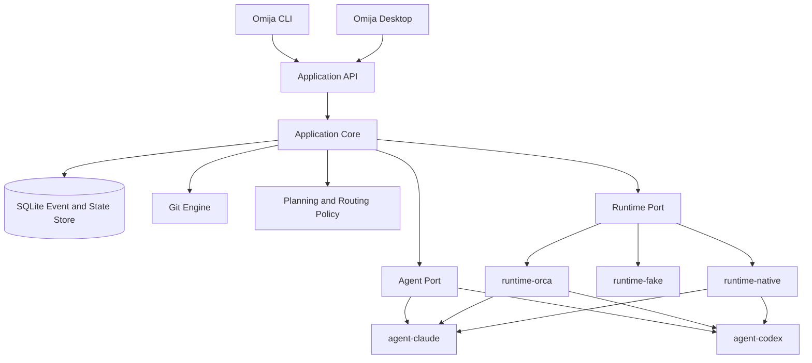

# Omija Architecture Overview

> Status: **Superseded** on 2026-09-04. Current direction: [Cofoco product spec](../../product-spec.md) and [architecture](../../architecture.md).
> Historical context only. Do not use as the current product direction.
> Original snapshot: Git tag `omija-phase0` (commit `974ca87`).
> Last updated: 2026-08-24

## 1. 문서 목적

이 문서는 Omija의 최초 제품 개론이자 아키텍처 기준점이다. CLI 하네스부터 향후 Desktop ADE까지 같은 제품 모델을 유지하기 위해 다음을 정의한다.

- 해결하려는 실제 작업 문제
- 제품과 각 실행 런타임의 책임 경계
- Run, Task, Worktree, Session의 관계
- Claude와 Codex를 함께 사용하는 방법
- 검증, 리뷰, rebase, 선형 통합 흐름
- CLI에서 Desktop으로 확장할 때 재사용할 코어
- 첫 프로토타입의 범위와 구현 순서

세부 구현이 이 문서와 달라질 수는 있지만, 핵심 개념이나 책임 경계를 바꿀 때는 변경 이유를 함께 기록한다.

## 2. 한 줄 정의

**Omija는 여러 코딩 에이전트와 Git worktree를 하나의 검증 가능한 작업 흐름으로 묶고, 결과를 안전하게 통합하는 worktree-native agent harness다.**

Omija는 에이전트 하나를 더 만드는 제품이 아니다. Claude Code, Codex 등 이미 잘하는 에이전트들을 적합한 작업에 배치하고, 각각의 실행 환경과 결과를 추적하며, Git history까지 정리하는 control plane이다.

## 3. 출발점: 현재의 수동 작업 방식

현재 작업은 대략 다음과 같이 진행된다.

1. 메인 세션에서 할 일을 수집한다.
2. 일을 몇 개의 독립 세션으로 나눌지 판단한다.
3. 작업 성격에 따라 Claude와 Codex를 배정한다.
4. 필요한 수만큼 worktree와 branch를 만든다.
5. 각 경로를 Orca workspace로 추가하고 터미널을 연다.
6. 기존 세션을 resume하거나 새 세션에 작업 지시서를 보낸다.
7. 각 worktree에서 구현과 단위 검증을 수행한다.
8. 결과를 rebase한 뒤 선형 history로 main에 통합한다.
9. worktree별 handoff, ignored 문서, 세션 기록을 수집한다.
10. 전체 코드 리뷰와 worklog로 작업을 마무리한다.

이 흐름의 개별 단계는 어렵지 않지만, 사람이 작업 분해와 상태 추적, context 이동, Git 조작을 반복해서 연결해야 한다. Omija의 첫 목표는 이 수동 연결부를 명시적인 상태 머신과 안전한 명령으로 바꾸는 것이다.

## 4. 제품의 핵심 명제

### 4.1 Git은 기반이고, worktree workflow가 제품이다

Git graph와 rebase는 중요하지만 제품의 중심은 단순 Git GUI가 아니다. 핵심은 다음 세 요소를 함께 다루는 것이다.

- 무엇을 병렬화할 것인가
- 각 작업을 어느 격리된 workspace에서 누가 수행할 것인가
- 결과를 어떤 검증과 순서로 하나의 history에 합칠 것인가

### 4.2 에이전트의 차이를 없애지 않는다

Claude와 Codex를 동일한 worker로 추상화하되, 둘의 모델, effort, 예산, session lifecycle, 강점까지 동일하다고 가정하지 않는다. 공통 실행 계약 위에서 provider별 capability를 보존한다.

### 4.3 자동화보다 복구 가능성이 우선이다

장기 실행 작업은 실패하고, 사용자가 중간에 개입하며, main이 움직이고, 세션이 종료될 수 있다. 모든 주요 작업은 재시도, resume, inspect, preview가 가능해야 한다.

### 4.4 사람의 승인 지점을 명시한다

계획 승인, 위험한 conflict resolution, main 반영은 명시적인 gate다. 프로젝트 정책으로 저위험 gate를 자동화할 수는 있지만, gate 자체를 숨기지 않는다.

### 4.5 CLI와 Desktop은 같은 코어의 서로 다른 client다

Desktop을 만들 때 CLI 로직을 다시 작성하지 않는다. 둘 다 동일한 application core와 daemon protocol을 사용한다.

## 5. 제품 범위와 Orca의 역할

### 5.1 초기 하네스

초기 버전은 Orca를 실행 runtime adapter로 사용할 수 있다. Orca는 다음을 이미 제공한다.

- tracked worktree와 workspace sidebar
- worktree별 terminal과 file context
- Claude/Codex 실행 및 prompt 전달
- Run, Task, Dispatch 기반 orchestration
- worker completion, question, escalation
- terminal과 session 상태 추적

Omija는 그 위에서 다음을 담당한다.

- 목표를 구조화된 Task DAG로 변환
- agent, model, effort, budget 배치
- worktree placement 정책
- task별 acceptance criteria와 verification
- Git integration preview와 적용
- 교차 review와 repair cycle
- Run 전체의 상태, 기록, 정리

### 5.2 향후 Desktop

Omija Desktop은 Orca를 대체할 수 있어야 하므로 Orca CLI를 필수 의존성으로 삼지 않는다.

- 초기 기본 runtime: `runtime-orca`
- 장기 기본 runtime: `runtime-native`
- 테스트 runtime: `runtime-fake`
- Orca는 장기적으로 선택적 bridge 또는 migration adapter로 유지할 수 있다.

Domain과 protocol에는 Orca의 `worktreeId`, `terminalHandle`, `dispatchId`가 노출되지 않는다. 외부 runtime 식별자는 adapter metadata로만 저장한다.

## 6. 핵심 도메인 모델

`Task = Worktree = Session`으로 모델링하지 않는다. 각 생명주기가 다르기 때문이다.

| 개념 | 의미 | 주요 생명주기 |
|---|---|---|
| `Run` | 사용자가 요청한 전체 목표와 실행 단위 | planned → running → integrating → reviewing → completed |
| `Task` | DAG 안의 논리적인 작업 항목 | pending → ready → running → verifying → succeeded/failed |
| `Lane` | branch와 worktree로 구성된 격리된 작업 공간 | creating → active → integrated → archived |
| `Session` | Claude/Codex 대화 및 프로세스 | starting → working → waiting → exited |
| `Attempt` | 한 Task를 특정 Lane과 Session에 배정한 한 번의 시도 | dispatched → working → succeeded/failed/abandoned |
| `Artifact` | report, test result, diff summary, transcript reference | created → retained/archived |
| `Integration` | 여러 Task 결과를 순서대로 조립한 후보 history | previewing → verifying → approved → applied |

이 분리를 통해 다음이 가능해진다.

- 실패한 Codex Attempt를 같은 Lane의 Claude Session이 이어받는다.
- 부분 결과가 의심스러우면 깨끗한 새 Lane에서 재시도한다.
- 한 Lane에 primary writer 하나와 read-only reviewer 여러 개를 둔다.
- Session이 종료되어도 Task와 Lane 상태는 보존한다.
- 한 Session을 즉시 다음 Task에 재사용하거나 안전하게 release한다.

## 7. 전체 시스템 구조



장기적으로 CLI와 Desktop은 다음과 같이 같은 local daemon을 사용한다.

```text
Omija CLI --------┐
                  ├── Omija Daemon ── Core / Git / Agents / Runtime / Store
Omija Desktop ----┘
```

초기 CLI는 일부 명령을 foreground에서 실행할 수 있지만, protocol과 state model은 daemon 전환을 막지 않도록 설계한다.

### 7.1 Run view

Run 하나를 사람이 보는 기본 화면은 worktree 단위 lane 그래프다. worktree 하나가 가로 한 줄이고, 그 줄에 Task, 담당 agent, 상태, 커밋 수가 붙는다. 줄들은 아래에서 integration 후보로 모이고 그 뒤에 apply 대상 branch가 온다.

```text
base <sha>
 │
 ├─ [task-a]  codex   도는 중     3 commits
 ├─ [task-b]  claude  검증 통과   2 commits
 └─ [task-c]  claude  범위 이탈   1 commit
                         │
                   preview --order
                         │
              integration  6 commits  (승인 대기)
                         │
                       main
```

**이 그림은 새 상태 저장소를 요구하지 않는다.** 필요한 것이 전부 ref에 있거나 ref로 옮길 수 있다.

| 보여줄 것 | 어디서 오나 |
|---|---|
| 기준 커밋 | `refs/omija/base/<run>` |
| lane 별 커밋 | `refs/omija/staging/<run>/<task>` 와 base의 차이 |
| 합쳐질 모양 | `refs/omija/integration/<run>` |
| 반영 완료 | `refs/omija/archive/<run>/<task>` |
| Task, agent, write scope, verify | `refs/omija/lane/<run>/<task>` (신규) |

`refs/omija/lane/<run>/<task>`는 dispatch할 때 한 번 쓰는 blob이다. Task 계약(9절)에서 사람이 볼 부분만 담는다.

**이것을 ref로 두는 이유를 남긴다.** 그림을 그리려고 runtime에 물어보면 Omija 코드가 Orca를 알아야 한다. Phase 0은 그 의존을 `SKILL.md` 산문 한 곳에 가두는 것이 설계의 핵심이었다(`phase-0-slice-design.md` 2절). agent 이름 하나를 얻으려고 그 경계를 깨지 않는다.

lane 상태는 ref의 유무로 파생한다. 상태 필드를 따로 쓰고 갱신하지 않는다.

| 상태 | 판정 |
|---|---|
| 도는 중 | lane ref는 있고 staging ref가 없다 |
| 스테이징 | staging ref가 있다 |
| 합쳐짐 | integration ref의 조상에 staging sha가 있다 |
| 반영됨 | archive ref가 있다 |

**살아있는 process 상태는 이 그림에 없다.** "agent가 지금 실제로 도는가"는 Git이 모르고 Runtime Port(5.2절)만 안다. Run view는 그것 없이도 쓸 만하므로 뒤로 미룬다. 필요해지면 `runtime-orca`가 lane의 liveness 한 칸만 채운다.

첫 구현은 터미널이다. `omija status <run>`이 스냅샷을 한 번 찍고, 다시 치는 것이 귀찮아지면 `omija watch <run>`을 더한다(15절). Omija는 런타임 의존성과 빌드 단계가 없으므로 TUI 라이브러리를 들이지 않고 ANSI로 그린다.

## 8. Source of truth

서로 다른 시스템의 상태를 하나의 DB가 임의로 대체하지 않는다.

| 상태 | Source of truth |
|---|---|
| Run 계획, 정책, gate | Omija store |
| commit, ref, dirty state, merge 가능성 | Git |
| terminal과 실제 process 상태 | 선택된 runtime adapter |
| 대화 continuation | provider session ID |
| test 성공 여부 | verification command의 exit/result artifact |

Omija는 외부 상태를 추측하지 않고 reconcile한다. 예를 들어 DB가 Session을 `working`으로 기억하더라도 runtime에서 process가 사라졌다면 Session을 `exited`로 전이하고 복구 선택지를 제시한다.

## 9. Task 계약

Planner는 자유 형식 prompt를 바로 실행하지 않고 검증 가능한 구조로 변환한다.

```yaml
version: 1
goal: 결제 실패 복구 UX를 구현한다
base: origin/main

tasks:
  - id: api-contract
    objective: 실패 응답 계약을 정리하고 테스트한다
    agent: claude
    effort: high
    workspace: top-level
    write_scope:
      - apps/api/**
    verify:
      - pnpm test api

  - id: client-recovery
    objective: 클라이언트 복구 UI와 상태 전이를 구현한다
    agent: codex
    effort: high
    workspace: top-level
    depends_on:
      - api-contract
    write_scope:
      - apps/web/**
    verify:
      - pnpm test web

integration:
  strategy: rebase-ff
  order:
    - api-contract
    - client-recovery
  require_approval: true

review:
  strategy: cross-provider
  max_repair_cycles: 2
```

각 Task packet에는 최소한 다음이 포함된다.

- 목표와 acceptance criteria
- 읽기/쓰기 범위
- dependency와 기준 commit SHA
- 필수 검증 명령
- commit policy
- 금지된 Git 작업
- 완료 보고 형식
- 질문과 escalation 방법

Worker는 task branch를 구현하고 검증하지만, rebase, merge, push는 수행하지 않는다. 통합은 Omija가 소유한다.

## 10. Run 실행 흐름

```text
Goal
  → Preflight
  → Plan
  → Approval Gate
  → Dispatch ready Tasks
  → Task Verification
  → Integration Preview
  → Full Verification
  → Cross-provider Review
  → Repair Tasks when needed
  → Apply Gate
  → Fast-forward Main
  → Archive and Worklog
```

### 10.1 Preflight

- repo와 base ref 확인
- main dirty state 확인
- base SHA 고정
- 필요한 CLI와 runtime capability 확인
- verification command 존재 여부 확인
- project policy와 concurrency budget 로드

### 10.2 Plan

- Task DAG 생성
- write scope 충돌 분석
- agent/model/effort 추천
- Lane 배치와 dependency 결정
- integration order와 review policy 생성

### 10.3 Dispatch

- 모든 ready Task를 먼저 시작해 병렬성을 확보한다.
- 독립 작업은 동일한 고정 base에서 top-level Lane으로 만든다.
- 실제로 선행 branch에 의존하는 작업만 stacked child Lane으로 만든다.
- 작업마다 단 하나의 primary writer를 둔다.

### 10.4 Verify

- worker 자체 검증
- Omija가 동일 명령을 다시 실행하는 독립 검증
- clean worktree와 예상 commit 범위 확인
- modified files가 write scope를 벗어났는지 확인

### 10.5 Review와 Repair

- 가능하면 구현하지 않은 provider가 최종 diff를 검토한다.
- review finding은 일반 문장이 아니라 새 repair Task로 변환한다.
- 정책으로 정한 최대 repair cycle을 넘기면 human gate로 전환한다.

### 10.6 Close

- Run dossier와 provider session ID 보관
- 완료된 worker terminal release
- clean하고 integrated된 Lane만 제거
- backup ref retention policy 적용
- main에서 fresh closeout Session으로 worklog 수행

## 11. Worktree와 Session 정책

### 11.1 Worktree는 Task와 일대일이 아니다

기본 구현 Task는 하나의 Lane을 사용하지만 다음을 허용한다.

- 같은 Lane에서 Session 교체
- 실패 후 새 Lane에서 새 Attempt
- 동일 Lane에서 read-only review Session 추가
- 연속된 작은 Task를 같은 clean Lane에서 수행

### 11.2 한 Lane에는 primary writer 하나

여러 Session이 같은 파일을 동시에 수정하지 않는다. 추가 reviewer와 tester는 기본적으로 read-only다. 병렬 쓰기가 필요하면 planner가 겹치지 않는 write scope를 명시해야 한다.

### 11.3 UI lineage와 Git ancestry를 분리한다

같은 Run에 속한다는 이유로 Git branch를 서로 stacked하지 않는다. UI에서는 Run 아래에 Lane을 그룹화할 수 있지만, Git base와 dependency는 별도로 모델링한다.

### 11.4 내부 subagent는 제한한다

Top-level parallelism과 worktree 생성은 Omija가 소유한다. Worker 내부 subagent는 분석이나 검증 같은 제한된 용도로 허용할 수 있으며, provider budget과 task policy를 따른다. Worker가 임의로 새 writer worktree를 만들지는 않는다.

## 12. Agent routing과 budget

초기 routing은 학습형 scheduler보다 명시적인 policy와 사용자 override로 시작한다.

| 작업 성격 | 초기 기본값 |
|---|---|
| 요구사항 정리와 범위 분해 | Claude |
| 좁은 구현, 테스트, 디버깅 | Codex |
| 광범위한 아키텍처 탐색 | Claude |
| 반복적인 리팩터링 | Codex |
| Codex 구현물 review | Claude |
| Claude 구현물 review | Codex |
| 위험한 변경 | 두 provider 독립 review |

이 표는 제품의 고정 진리가 아니라 초기 profile이다. Run 결과를 바탕으로 성공률, 수정 횟수, 소요 시간, 사용량을 기록해 프로젝트별 기본값을 조정한다.

예산은 provider 이름만이 아니라 Task profile에 포함한다.

```yaml
agent: auto
model: auto
effort: high
budget:
  max_turns: 30
  soft_tokens: 120000
  max_usd: 5
subagents:
  policy: bounded
  max: 3
```

전체 Run 예산을 구현에서 소진하지 않도록 verification, review, repair reserve를 둔다.

## 13. Git integration 모델

main에서 작업 branch를 직접 rebase하지 않는다. 실제로 적용할 graph를 별도 integration Lane에서 먼저 만든다.

```text
main/base SHA
   ├── task-a
   └── task-b
          ↓
omija/integration/<run-id>
          ↓
staging refs rebase in integration order
          ↓
full verification and review
          ↓
main --ff-only
```

예정된 ref namespace:

```text
refs/omija/staging/<run-id>/<task-id>
refs/omija/archive/<run-id>/<task-id>
```

통합 규칙:

- 실제 task branch를 preview 때문에 rewrite하지 않는다.
- staging ref 복사본을 integration head 위로 rebase한다.
- 각 성공 결과를 integration branch에 fast-forward로 쌓는다.
- conflict가 발생하면 conflict-resolution Task를 만든다.
- 전체 verification과 review가 끝날 때까지 main을 수정하지 않는다.
- main이 base SHA에서 움직였으면 integration preview를 새 base에서 재생성한다.
- 최종 적용은 가능한 경우 `--ff-only`로 제한한다.

이 integration candidate 자체가 Desktop에서 보여줄 “적용 후 예상 graph”의 source가 된다.

## 14. 상태와 파일 저장

### 14.1 버전 관리 대상

```text
.omija/
├── config.yaml
├── verify.yaml
├── policies/
└── prompts/
```

프로젝트가 공유해야 하는 agent policy, verification, setup 정보는 저장소에 commit한다.

### 14.2 Worktree 공용 실행 상태

각 worktree가 같은 상태를 보도록 Git common directory를 사용한다.

```text
<git-common-dir>/omija/
├── state.db
├── runs/
├── logs/
├── artifacts/
└── integration-previews/
```

이 경로는 coordinator가 관리한다. Worker가 SQLite나 orchestration state를 직접 수정하지 않는다.

### 14.3 전역 상태

사용자 선호, 등록된 repo, provider 설정, daemon socket은 OS별 application data directory에 저장한다. 프로젝트 state와 전역 state를 섞지 않는다.

## 15. CLI 초안

```text
omija init
omija doctor
omija plan "<goal>"
omija plan show <run>
omija approve <run>
omija run <plan-or-run>
omija status [run]
omija watch [run]
omija task retry <task>
omija task assign <task> --agent <agent>
omija session focus <session>
omija integrate <run> --preview
omija integrate <run> --apply
omija review <run>
omija close <run>
```

MVP에서는 모든 명령을 구현하지 않는다. 첫 vertical slice에 필요한 명령부터 얇게 만든다.

## 16. 저장소 구조

Omija는 skills 저장소와 분리된 독립 제품 저장소다. CLI와 Desktop은 같은 monorepo에서 core를 공유한다.

```text
omija/
├── apps/
│   ├── cli/
│   └── desktop/
├── packages/
│   ├── core/
│   ├── protocol/
│   ├── store-sqlite/
│   ├── git-engine/
│   ├── agent-claude/
│   ├── agent-codex/
│   ├── runtime-orca/
│   ├── runtime-native/
│   └── runtime-fake/
├── schemas/
└── docs/
```

Desktop 앱 디렉터리는 `omija-ADE`가 아니라 `apps/desktop`을 사용한다.

- 제품명: Omija
- 카테고리: Agentic Development Environment
- package: `@omija/desktop` 또는 실제 배포 scope
- 앱 표시 이름: `Omija`

`ADE`를 디렉터리와 제품명에 반복해서 넣지 않는다. 향후 제품 정의가 넓어져도 저장소 구조를 바꿀 필요가 없게 한다.

## 17. 구현 단계

### Phase 0: Foundation

- 제품 개론과 domain glossary
- Run plan schema
- runtime/agent/git port 정의
- event와 error taxonomy
- CLI skeleton과 fake runtime

### Phase 1: Read-only CLI

- repo preflight
- worktree discovery
- Git graph와 branch 상태
- plan validation
- 예상 task placement 출력

### Phase 2: Orca vertical slice

- `runtime-orca`
- 두 개의 Task 생성
- Claude와 Codex를 각각 새 Lane에 dispatch
- completion과 question 수집
- task verification

### Phase 3: Integration engine

- staging/archive ref
- disposable integration Lane
- rebase conflict detection
- before/after graph preview
- full verification
- 승인 후 main fast-forward

### Phase 3.5: Run view

- `refs/omija/lane/<run>/<task>` 쓰기와 읽기
- `omija status <run>`: ref만 읽어 lane 그래프를 그린다
- `omija watch <run>`: 같은 그림을 주기적으로 다시 찍는다
- JSON 출력을 같이 낸다. Desktop이 이 그림을 다시 만들지 않게 한다

**정수 번호를 새로 쓰지 않은 이유**: `phase-0-slice-design.md`가 "Phase 4 (`runtime-native`)"를 이름으로 참조한다. 뒤 단계를 밀면 그 참조가 조용히 어긋난다.

이 단계가 Phase 5보다 앞으로 온 이유: 그림에 필요한 상태가 Phase 3에서 이미 전부 ref로 존재한다(7.1절). 그림을 Desktop까지 미루면, 정작 Orca sidebar와 `git log`를 번갈아 보며 lane 상태를 사람이 머릿속에서 합치는 지금 상황이 그대로 남는다. 그리고 그래프 모양이 쓸 만한지는 터미널에서 먼저 알아내는 편이 싸다.

### Phase 4: Native runtime와 daemon

- PTY/process supervisor
- provider session resume
- normalized event stream
- crash recovery와 reconciliation
- CLI를 daemon client로 전환

### Phase 5: Desktop

Desktop의 기본 화면은 Phase 3.5의 lane 그래프 그대로다. 파일트리와 터미널을 늘어놓은 IDE가 아니라, 도는 Run 자체가 화면이고 나머지는 노드에서 파고 들어가는 것이다.

- lane 그래프를 기본 화면으로. worktree별 구역, Task와 agent를 노드에 붙인다
- 노드를 열면 그때 terminal, diff, verification, review가 나온다
- integration preview와 apply 결과를 같은 그래프 위에서 보여준다
- Git operation journal과 recovery UI
- 살아있는 process 상태를 Runtime Port로 채운다(7.1절이 미뤄둔 칸)

**바뀐 것과 이유**: 이전 목록은 sidebar와 file tree를 중심에 둔 IDE 배치였다. 수동 작업 방식(3절)에서 사람이 실제로 잃는 것은 편집기가 아니라 "지금 몇 갈래가 어디까지 왔는지"이므로, 기본 화면을 그 답으로 바꾼다. 편집기 전체를 만들지 않는 것은 20절 비목표에 이미 있다.

## 18. 첫 번째 vertical slice

첫 프로토타입의 완료 조건은 다음 한 시나리오다.

> 구조화된 plan으로 두 Task를 받는다. Claude와 Codex를 각각 Orca가 추적하는 독립 worktree에서 실행한다. 두 결과의 검증이 끝나면 별도 integration branch에 선형 history를 만들고 예상 graph를 보여준다. 사용자가 승인하면 전체 review와 verification을 거쳐 main을 fast-forward하고 worklog를 남긴다.

이 시나리오가 끝날 때 확인할 항목:

- Orca sidebar에서 두 Lane과 agent session이 보이는가
- Task와 Session이 분리된 상태로 재시도 가능한가
- 한 worker가 실패해도 다른 결과와 Run state가 보존되는가
- main을 건드리지 않고 실제 rebase 결과를 preview할 수 있는가
- main drift와 conflict가 명확하게 표시되는가
- 전체 review finding을 repair Task로 되돌릴 수 있는가
- worktree 제거 후에도 Run dossier와 session reference가 남는가

## 19. 안전 불변식

- main은 최종 apply 전까지 수정하지 않는다.
- 사용자 dirty state를 자동 stash하거나 폐기하지 않는다.
- destructive Git operation 전에는 정확한 대상 ref와 worktree를 확인한다.
- preview는 실제 적용과 같은 Git 연산을 disposable ref에서 수행한다.
- 모든 mutation은 operation journal에 기록한다.
- 완료된 Task는 검증 결과와 commit 범위를 가져야 한다.
- worker는 자신의 Task branch를 통합하거나 push하지 않는다.
- runtime handle은 영속 identity로 취급하지 않고 reconcile한다.
- retry와 cleanup은 idempotent해야 한다.

## 20. 초기 비목표

- 범용 코드 편집기 전체를 처음부터 구현
- cloud agent hosting
- 모든 SCM 지원
- 자동 conflict resolution의 무조건 적용
- provider 내부 transcript format을 Omija의 영속 protocol로 사용
- 자연어 planner가 승인 없이 모든 작업을 즉시 실행
- GitKraken의 모든 Git 기능을 첫 CLI에 복제

## 21. 초기 기술 방향

현재 기본 방향은 다음과 같다.

- TypeScript
- Node.js 기반 CLI와 local daemon
- pnpm workspace
- SQLite state store
- Git CLI를 우선 사용하고 structured parser를 둠
- provider CLI/SDK output을 adapter에서 normalize
- Desktop framework는 core와 daemon이 안정된 뒤 결정

Electron은 Node process/PTY 코드를 재사용하기 쉽고, Tauri는 배포 크기와 native shell 측면의 장점이 있다. 이 선택이 core를 바꾸지 않도록 Desktop은 protocol client로 제한한다.

## 22. 브랜딩 메모

- 제품명: **Omija**
- 의미: 서로 다른 맛을 가진 agent들을 하나의 workflow로 묶음
- 시각 언어: 오미자 열매를 Git/worktree node로 표현
- category: worktree-native agent harness / ADE
- `Gitrus`는 향후 Git graph 또는 integration engine의 feature codename 후보로 남긴다.

코드의 domain terminology는 `Run`, `Task`, `Lane`, `Session`, `Integration`을 유지한다. `berry`, `vine`, `harvest` 같은 브랜드 은유를 protocol과 schema에 넣지 않는다.

## 23. 확정된 초기 결정

1. Omija는 skills collection이 아닌 별도 제품 저장소다.
2. CLI와 향후 Desktop은 같은 저장소와 application core를 사용한다.
3. Desktop 디렉터리는 `apps/desktop`이다.
4. Orca는 초기 runtime adapter이며 영구 필수 의존성이 아니다.
5. Git과 runtime의 실제 상태는 Omija DB가 임의로 대체하지 않는다.
6. Task, Lane, Session, Attempt를 별도 entity로 모델링한다.
7. 통합은 disposable integration candidate에서 검증한 뒤 main에 fast-forward한다.
8. 첫 구현 목표는 두 provider와 두 worktree를 사용하는 하나의 완전한 vertical slice다.
